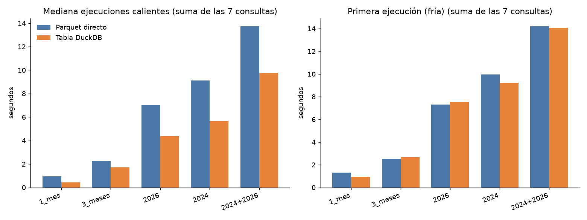

# Ejercicio 6: Parquet directo vs tabla DuckDB materializada

Todos los números de este documento son mediciones reales (DuckDB 1.5.5 en el contenedor `lab8-lab`, 16 CPU lógicos, archivos en un volumen montado desde Windows) tomadas con `scripts/benchmark.py`. Los datos crudos están en `docs/benchmark_resultados.csv` (350 mediciones) y `docs/benchmark_resultados_creacion.csv`; las consultas, en `sql/06_benchmark.sql`; el análisis interactivo, en `notebooks/06_benchmark.ipynb`; el gráfico, en `docs/img/06_benchmark.png`.

Reproducir: `docker exec lab8-lab sh -c "python /workspace/scripts/benchmark.py --repeticiones 5"` (argumentos: `--repeticiones`, `--salida`, `--db`, `--datos`, `--sql`, `--tamanos`).

## Metodología

- **Datos**: yellow + green, 2024 (12 meses) y 2026 (ene a ago), 40 archivos Parquet, 1229 MB, **71.870.407 viajes** (yellow 2024: 41.169.720; yellow 2026: 29.703.355; green 2024: 660.218; green 2026: 337.114).
- **6.1 Parquet directo**: `read_parquet([...], union_by_name=true, filename=true)`. `union_by_name` es necesario porque 2026 trae columnas extra (`cbd_congestion_fee`, `request_source`).
- **6.2 Tabla materializada** `taxi_trips` en `data/processed/taxi.duckdb` (ignorada por git) con 13 columnas normalizadas: `tipo_taxi`, `pickup_datetime`, `dropoff_datetime` (unificando `tpep_*`/`lpep_*`), `passenger_count`, `trip_distance`, `PULocationID`, `DOLocationID`, `payment_type`, `fare_amount`, `tip_amount`, `total_amount`, `anio`, `mes`. `anio` y `mes` salen del **nombre del archivo** (no del timestamp, que en los datos TLC contiene fechas fuera de rango), de modo que filtrar por `anio/mes` en la tabla es exactamente equivalente a elegir archivos en Parquet.
- **Comparación justa**: cada consulta es **idéntica** y se ejecuta sobre una vista temporal `trips`. En Parquet la vista aplica la misma proyección normalizada sobre `read_parquet` (solo los archivos del tamaño correspondiente, por lista de rutas); en tabla es `SELECT * FROM taxi_trips WHERE <filtro anio/mes>`. Así las dos rutas leen y calculan las mismas columnas.
- **Verificación**: para cada una de las 35 combinaciones (7 consultas x 5 tamaños) el script compara el resultado completo de ambas rutas (floats redondeados a 6 decimales): **0 discrepancias**. Además, el conteo total es 71.870.407 en ambas.
- **Frío vs caliente**: cada (tamaño, fuente, consulta) usa una **conexión nueva**; la repetición 1 es la ejecución *fría* (sin caché de metadatos ni buffers de DuckDB) y las repeticiones 2 a 5 son *calientes*; se reporta la **mediana** de las 4 calientes. La caché de archivos del sistema operativo **no** se vacía (no hay privilegios en el contenedor), por lo que "frío" significa "frío para DuckDB", no "frío de disco". La variación entre repeticiones calientes (rango/mediana) tiene mediana de 17 %, así que diferencias de pocos milisegundos o menores al 20 % no son concluyentes.
- **6.6 Tamaños**: 1 mes (2024-01), 3 meses (2024-01 a 03), 2026 (8 meses), 2024 (12 meses) y 2024+2026 (20 meses). La tabla se materializa **una sola vez** (los 20 meses) y los tamaños menores se obtienen filtrando por `anio/mes`; además se mide el costo de materializar cada subconjunto por separado para el análisis de amortización. Para Parquet, los tamaños menores leen solo los archivos correspondientes.

## 6.2 Costo de materializar y tamaño en disco

| Tamaño | Filas | Creación (s) | Parquet (MB) | .duckdb (MB) | .duckdb / Parquet |
|---|---:|---:|---:|---:|---:|
| 1 mes (2024-01) | 3.021.175 | 3,07 | 51,3 | 68,2 | 1,33 |
| 3 meses (2024-01 a 03) | 9.722.363 | 4,78 | 164,4 | 212,1 | 1,29 |
| 2026 (8 meses) | 30.040.469 | 12,27 | 519,7 | 650,9 | 1,25 |
| 2024 (12 meses) | 41.829.938 | 17,70 | 708,9 | 916,2 | 1,29 |
| **2024+2026 (20 meses)** | **71.870.407** | **23,52** (22,38 s en la corrida de la tabla principal) | **1228,7** | **1565,0** | **1,27** |

Hallazgo: la tabla DuckDB ocupa **~27 % más** que los Parquet de origen (1565 vs 1229 MB), porque las 13 columnas se guardan con la compresión por defecto de DuckDB (columnas `DOUBLE` sin recodificar) mientras que los archivos TLC ya vienen comprimidos con Parquet. La materialización no ahorra espacio; se paga en disco y en tiempo (~23 s, equivalente a ~3 millones de filas por segundo).

## 6.3 a 6.5 Consultas y tiempos (ejecución fría y mediana en caliente)

Consultas (detalle comentado en `sql/06_benchmark.sql`): Q1 conteo total; Q2 agregación por año/mes/tipo; Q3 distancia y tarifa promedio por tipo; Q4 distribución por hora; Q5 top 10 zonas de recogida; Q6 percentiles de propina (p50/p90/p99, pago con tarjeta); Q7 filtro selectivo (distancia > 100 y total > 300).

Detalle completo, todos los tamaños (segundos):

| Tamaño | Consulta | Parquet frío (s) | Tabla fría (s) | Parquet caliente, mediana (s) | Tabla caliente, mediana (s) | Aceleración caliente |
|---|---|---:|---:|---:|---:|---:|
| 1_mes (2024-01) | Q1_conteo_total | 0.033 | 0.025 | 0.032 | 0.003 | 11.9x |
| 1_mes (2024-01) | Q2_agregacion_por_mes | 0.116 | 0.109 | 0.094 | 0.035 | 2.7x |
| 1_mes (2024-01) | Q3_promedio_por_tipo | 0.131 | 0.084 | 0.081 | 0.015 | 5.5x |
| 1_mes (2024-01) | Q4_distribucion_por_hora | 0.231 | 0.116 | 0.188 | 0.016 | 11.4x |
| 1_mes (2024-01) | Q5_top_zonas | 0.082 | 0.077 | 0.080 | 0.010 | 8.2x |
| 1_mes (2024-01) | Q6_percentiles_propina | 0.634 | 0.456 | 0.385 | 0.342 | 1.1x |
| 1_mes (2024-01) | Q7_filtro_selectivo | 0.098 | 0.066 | 0.095 | 0.007 | 13.0x |
| 3_meses (2024-01..03) | Q1_conteo_total | 0.046 | 0.019 | 0.044 | 0.003 | 14.7x |
| 3_meses (2024-01..03) | Q2_agregacion_por_mes | 0.174 | 0.221 | 0.166 | 0.081 | 2.0x |
| 3_meses (2024-01..03) | Q3_promedio_por_tipo | 0.229 | 0.219 | 0.159 | 0.030 | 5.3x |
| 3_meses (2024-01..03) | Q4_distribucion_por_hora | 0.344 | 0.271 | 0.353 | 0.042 | 8.4x |
| 3_meses (2024-01..03) | Q5_top_zonas | 0.169 | 0.166 | 0.129 | 0.019 | 6.9x |
| 3_meses (2024-01..03) | Q6_percentiles_propina | 1.407 | 1.638 | 1.235 | 1.518 | 0.8x |
| 3_meses (2024-01..03) | Q7_filtro_selectivo | 0.173 | 0.125 | 0.168 | 0.016 | 10.3x |
| 2026 (8 meses) | Q1_conteo_total | 0.066 | 0.022 | 0.076 | 0.005 | 16.8x |
| 2026 (8 meses) | Q2_agregacion_por_mes | 0.555 | 0.855 | 0.471 | 0.219 | 2.1x |
| 2026 (8 meses) | Q3_promedio_por_tipo | 0.595 | 0.707 | 0.547 | 0.090 | 6.1x |
| 2026 (8 meses) | Q4_distribucion_por_hora | 0.972 | 0.894 | 0.963 | 0.109 | 8.8x |
| 2026 (8 meses) | Q5_top_zonas | 0.482 | 0.544 | 0.427 | 0.068 | 6.3x |
| 2026 (8 meses) | Q6_percentiles_propina | 4.069 | 4.090 | 4.008 | 3.834 | 1.0x |
| 2026 (8 meses) | Q7_filtro_selectivo | 0.575 | 0.442 | 0.510 | 0.053 | 9.6x |
| 2024 (12 meses) | Q1_conteo_total | 0.148 | 0.027 | 0.189 | 0.006 | 30.5x |
| 2024 (12 meses) | Q2_agregacion_por_mes | 0.708 | 1.038 | 0.655 | 0.262 | 2.5x |
| 2024 (12 meses) | Q3_promedio_por_tipo | 0.639 | 0.869 | 0.603 | 0.121 | 5.0x |
| 2024 (12 meses) | Q4_distribucion_por_hora | 1.304 | 1.128 | 1.217 | 0.140 | 8.7x |
| 2024 (12 meses) | Q5_top_zonas | 0.563 | 0.608 | 0.499 | 0.069 | 7.3x |
| 2024 (12 meses) | Q6_percentiles_propina | 6.021 | 5.088 | 5.457 | 5.006 | 1.1x |
| 2024 (12 meses) | Q7_filtro_selectivo | 0.567 | 0.461 | 0.502 | 0.058 | 8.6x |
| 2024+2026 (20 meses) | Q1_conteo_total | 0.234 | 0.095 | 0.222 | 0.102 | 2.2x |
| 2024+2026 (20 meses) | Q2_agregacion_por_mes | 1.059 | 1.551 | 1.073 | 0.443 | 2.4x |
| 2024+2026 (20 meses) | Q3_promedio_por_tipo | 0.894 | 1.072 | 0.896 | 0.285 | 3.1x |
| 2024+2026 (20 meses) | Q4_distribucion_por_hora | 1.779 | 1.566 | 1.790 | 0.305 | 5.9x |
| 2024+2026 (20 meses) | Q5_top_zonas | 0.814 | 0.912 | 0.760 | 0.229 | 3.3x |
| 2024+2026 (20 meses) | Q6_percentiles_propina | 8.497 | 8.153 | 8.109 | 8.293 | 1.0x |
| 2024+2026 (20 meses) | Q7_filtro_selectivo | 0.925 | 0.713 | 0.884 | 0.103 | 8.6x |

## 6.7 Tabla resumen (suma de las 7 consultas, segundos)

| Tamaño | Parquet frío | Tabla fría | Parquet caliente (mediana) | Tabla caliente (mediana) | Aceleración caliente | Aceleración fría |
|---|---:|---:|---:|---:|---:|---:|
| 1 mes | 1,32 | 0,93 | 0,96 | 0,43 | 2,2x | 1,4x |
| 3 meses | 2,54 | 2,66 | 2,25 | 1,71 | 1,3x | 1,0x |
| 2026 (8 meses) | 7,32 | 7,55 | 7,00 | 4,38 | 1,6x | 1,0x |
| 2024 (12 meses) | 9,95 | 9,22 | 9,12 | 5,66 | 1,6x | 1,1x |
| 2024+2026 (20 meses) | 14,20 | 14,06 | 13,73 | 9,76 | 1,4x | 1,0x |

La suma está dominada por **Q6** (percentiles exactos con `quantile_cont`, 0,3 s a 8,3 s): es CPU-bound (ordenar/seleccionar ~50 M valores) y no depende del formato, por lo que ahí la tabla no gana (0,8x a 1,1x, dentro del ruido). Sin Q6, la aceleración en caliente de la tabla sobre Parquet es de 6,6x (1 mes), 5,3x (3 meses), 5,5x (2026), 5,6x (2024) y 3,8x (20 meses):

| Tamaño | Parquet caliente sin Q6 (s) | Tabla caliente sin Q6 (s) | Aceleración |
|---|---:|---:|---:|
| 1 mes | 0,570 | 0,086 | 6,6x |
| 3 meses | 1,019 | 0,191 | 5,3x |
| 2026 (8 meses) | 2,993 | 0,543 | 5,5x |
| 2024 (12 meses) | 3,665 | 0,657 | 5,6x |
| 2024+2026 (20 meses) | 5,624 | 1,467 | 3,8x |

## 6.8 Queries

Las siete consultas, la creación de la tabla y la consulta directa a Parquet (6.1) están comentadas en `sql/06_benchmark.sql`. `scripts/benchmark.py` lee ese mismo archivo, así que la documentación y lo que se ejecuta no pueden divergir.

## 6.9 Análisis de las diferencias

1. **Consultas ligeras y selectivas: la tabla gana por mucho.** En caliente, Q1/Q4/Q5/Q7 son entre 3x y 30x más rápidas (p. ej. Q1 sobre 2024: 0,189 s vs 0,006 s, 30x; Q7 sobre 20 meses: 0,884 s vs 0,103 s, 8,6x). Q2/Q3 ganan 2x a 6x.
2. **Por qué**:
   - **Formato columnar propio sin decodificación del contenedor**: DuckDB lee sus row groups ya en su representación interna (vectores), sin descomprimir/decodificar páginas Parquet ni convertir tipos en cada ejecución.
   - **Estadísticas y metadatos ya cargados**: la tabla guarda min/max y conteos por segmento; Q1 y Q7 se resuelven casi solo con metadatos y filtrando segmentos (zonemaps). Con Parquet también hay estadísticas por row group, pero hay que leer y parsear el *footer* de cada archivo en cada consulta nueva.
   - **Sin descubrimiento de archivos ni unión de esquemas**: con `union_by_name` y 40 archivos, cada ejecución abre cada archivo, lee su footer, reconcilia esquemas y aplica la proyección/regexp de `filename`. Este costo fijo se ve en Q1 (0,03 s con 1 mes a 0,22 s con 20 meses, creciendo con el número de archivos). La tabla paga la regexp una vez, al materializar (`anio`/`mes` ya son columnas).
   - **Solo se leen las columnas necesarias** en ambos casos, pero la tabla evita además el parseo de `filename` por fila.
3. **Lo que no cambia**: Q6 (percentiles exactos) es cómputo puro y tarda lo mismo con ambos formatos (8,1 s vs 8,3 s con 20 meses). Cuando el cuello de botella es el operador y no la lectura, materializar no ayuda.
4. **Frío vs caliente**: para Parquet, frío y caliente son casi iguales (el costo de footers se repite en cada conexión; la cache de metadatos de DuckDB no está activa por defecto). Para la tabla, la primera ejecución en una conexión nueva paga la carga de los bloques desde el `.duckdb` al buffer de DuckDB, y en frío **la ventaja desaparece**: aceleración fría de 1,0x a 1,4x en la suma, y en Q2 con 20 meses la tabla fría (1,55 s) fue incluso más lenta que Parquet frío (1,06 s). La ventaja de la tabla aparece cuando la conexión está caliente (proceso persistente, notebook, servidor). (Matiz: la caché de archivos del SO estaba caliente en ambos casos; con disco realmente frío los números absolutos serían mayores y no medimos eso.)
5. **Efecto del tamaño**: la aceleración en caliente no crece con el tamaño; es mayor con pocos datos (donde domina el costo fijo de abrir archivos: 6,6x con 1 mes) y se reduce con 20 meses (3,8x sin Q6). Una hipótesis (no verificada) para el 20 meses es que el filtro `(anio=2024) OR (anio=2026)` de la vista de la tabla impide atajos de metadatos: Q1 pasó de 0,006 s (2024 solo) a 0,102 s (20 meses), mientras que Parquet pasó de 0,189 s a 0,222 s. Para este caso conviene consultar `taxi_trips` directamente sin filtro.
6. **Costo de materializar y amortización**: crear la tabla de 20 meses cuesta 23,5 s (22,4 s en la corrida principal) y 1565 MB (27 % más que los Parquet). El ahorro por ronda de las 7 consultas (en caliente) es de 3,97 s en 20 meses, es decir se amortiza tras **~5,9 rondas**; contando solo las consultas sin Q6 (el ahorro real por formato es ~4,2 s) la amortización es de ~5,6 rondas. Para 1 mes, 5,8 rondas; para 2026, 4,7; para 2024, 5,1; para 3 meses, 8,8. Es decir, **si el conjunto se consulta más de ~6 veces (7 consultas cada vez), materializar sale a cuenta; si se consulta una o dos veces, es mejor Parquet directo**. Además la tabla se reutiliza entre sesiones (la creación se paga una sola vez), mientras que cada consulta Parquet paga siempre su costo fijo.

## 6.10 Escenarios apropiados

**Parquet directo es mejor cuando:**
- Exploración puntual o única (EDA rápida, validar un archivo recién descargado): cero espera previa y cero espacio extra.
- Los datos cambian o se agregan archivos con frecuencia (cada mes publica uno nuevo): no hay que mantener ni refrescar una copia.
- Hay poco disco libre, o los mismos archivos Parquet los consumen otras herramientas (Spark, pandas, Metabase por otra ruta).
- La carga es dominada por cómputo pesado (como Q6), donde el formato no importa.
- Se consulta una porción pequeña (pocos archivos) y casi siempre una sola vez.

**Tabla DuckDB materializada es mejor cuando:**
- Se ejecutan muchas consultas repetidas sobre los mismos datos (dashboards, notebooks, análisis iterativo): el costo de ~23 s se amortiza en ~5 a 6 rondas.
- Se necesita latencia baja y estable (conteos, filtros selectivos, agregaciones por hora/zona: milisegundos a décimas de segundo).
- El esquema ya está normalizado (yellow y green unificados, `anio`/`mes` como columnas), de modo que los usuarios no repiten la lógica de unión ni el parseo de `filename`.
- Se quieren índices/restricciones, transacciones, vistas persistentes o actualizaciones, cosas que Parquet no ofrece.
- Se acepta el costo de ~1,27x de espacio y un solo proceso escritor a la vez (varios lectores `read_only` sí son posibles).

Estrategia mixta recomendada: conservar los Parquet como fuente de verdad y reconstruir la tabla (o solo los meses nuevos con `INSERT ... SELECT`) cuando llegue un archivo nuevo; usar Parquet directo para validaciones y la tabla para el trabajo analítico recurrente.

## Notas y limitaciones

- No se usó `ORDER BY` al crear la tabla (agotaba la memoria del contenedor); el orden de inserción sigue el orden de archivos (anio, mes), lo que ya da buenas estadísticas min/max por `anio/mes`.
- Un solo equipo, un solo conjunto de 5 repeticiones por combinación (1 fría + 4 calientes); la variación entre calientes tiene mediana de ~17 %, por lo que se resumió con la mediana.
- La caché del sistema operativo no se vació.
- Conexiones cerradas al terminar cada medición; `taxi.duckdb` no se versiona (`data/processed/**` está en `.gitignore`).
