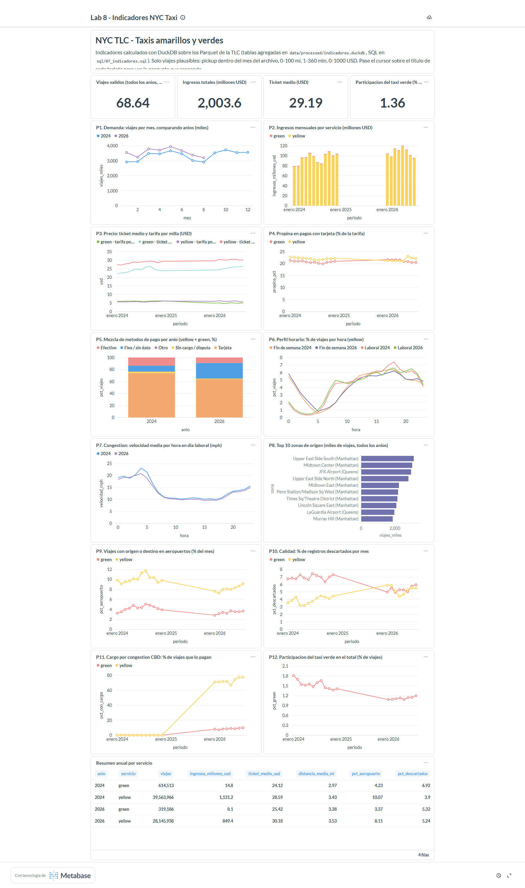

# Ejercicio 7 - Indicadores y tablero en Metabase

SQL: [`sql/07_indicadores.sql`](../sql/07_indicadores.sql) ·
Scripts: [`scripts/build_indicadores.py`](../scripts/build_indicadores.py),
[`scripts/metabase_dashboard.py`](../scripts/metabase_dashboard.py),
[`scripts/capturar_tablero.ps1`](../scripts/capturar_tablero.ps1)

Este documento describe el tablero construido con los datos de **2024 y 2026** (estado previo al
Ejercicio 8). La version con 2025 incluido esta en [`docs/08_incorporacion_2025.md`](08_incorporacion_2025.md).

## Arquitectura y decisiones (7.3, 7.4)

```
data/raw/{yellow,green}/<anio>/*.parquet ──┐
data/raw/zonas/taxi_zone_lookup.csv ───────┤  build_indicadores.py (DuckDB, ~1-2 min)
                                           ▼
                     data/processed/indicadores.duckdb   (5 tablas agregadas, 1,5 MB)
                                           │  driver DuckDB de Metabase (solo lectura)
                                           ▼
                     Metabase: 17 tarjetas SQL nativas -> tablero "Lab 8 - Indicadores NYC Taxi"
```

Decisiones:

1. **Tablas agregadas en vez de consultar Parquet desde Metabase.** Cada tarjeta leeria 72 M de
   filas (113 M con 2025) en cada apertura del tablero; con las tablas agregadas cada tarjeta
   responde en milisegundos y el archivo pesa 1,5 MB (frente a 1,5 GB de la tabla completa del
   Ejercicio 6). Las agregaciones pesadas se pagan una vez, al reconstruir.
2. **Una sola fuente de verdad para el SQL.** Cada tarjeta es un bloque `-- @tarjeta <id> | <grafico> | <titulo>`
   de `sql/07_indicadores.sql`; `metabase_dashboard.py` crea las tarjetas a partir de ese archivo,
   asi que el SQL documentado y el del tablero no pueden divergir.
3. **El SQL no menciona anios.** El anio y el mes salen del nombre del archivo (`regexp_extract` sobre
   `filename`), no del timestamp (que trae fechas fuera de rango, ver Ej. 3), y la ruta usa `*/*.parquet`.
4. **Viajes "validos"** (mismas reglas que el EDA del Ej. 4): pickup dentro del mes del archivo,
   0 < distancia < 100 mi, 1-360 min, 0 < total <= 1000 USD, tarifa >= 0. Lo descartado no se
   esconde: es un indicador (P10).
5. **Metabase abre la base en solo lectura** (`read_only: true`); la reconstruccion escribe a un
   archivo temporal y lo reemplaza al final, para que Metabase nunca vea una base a medio construir.

Tablas que se materializan:

| Tabla | Grano | Contenido |
|---|---|---|
| `zonas` | LocationID | Catalogo oficial TLC (265 zonas) |
| `ind_mensual` | anio, mes, servicio | Registros, viajes validos, ingresos, ticket, tarifa/milla, distancia, duracion, velocidad, pasajeros, propina, aeropuertos, cargo CBD y contadores de calidad |
| `ind_pago` | anio, mes, servicio, metodo | Viajes por metodo de pago |
| `ind_hora` | anio, servicio, tipo de dia, hora | Viajes, velocidad media y ticket |
| `ind_zonas` | anio, servicio, zona de origen | Viajes e ingresos |

## 7.1 y 7.2 Preguntas e indicadores (con su interpretacion)

12 preguntas (7.1), cada una con su indicador (7.2), mas 4 KPI y 1 tabla resumen. Cada tarjeta tiene en
Metabase la pregunta que responde como descripcion. Resultados e interpretacion con 2024 + 2026:

| Id | Pregunta | Definicion | Lectura (2024 + 2026) |
|---|---|---|---|
| K1-K4 | Tamano del sistema | Viajes validos, ingresos, ticket medio, % verde | 68,6 M viajes; 2.003,6 M USD; 29,19 USD; verde 1,36 % |
| P1 | Como evoluciona la demanda? | Viajes por mes, una serie por anio | 2026 supera a 2024 en todos los meses ene-ago (+10,7 % yellow); estacionalidad: picos en marzo-mayo y caida en julio-agosto |
| P2 | Cuanto se factura y quien? | Ingresos mensuales por servicio | 80-120 M USD/mes; yellow aporta ~99 % |
| P3 | Se encarece el viaje? | Ticket medio y tarifa por milla | Ticket yellow 28,3 -> 30,2 USD (+6,7 %) y tarifa por milla 5,69 -> 6,01 USD (+5,6 %, ene-ago, ambos servicios): sube la tarifa base y ademas se suma el cargo CBD |
| P4 | Cambia la propina? | Propina / tarifa en pagos con tarjeta | Estable: ~22 % yellow, ~21 % green |
| P5 | Como se paga? | % de viajes por metodo de pago | Tarjeta 74 % -> 64 %; "Flex / sin dato" (`payment_type = 0`) 9 % -> 26 %; efectivo 14 % -> 9 % |
| P6 | A que hora se viaja? | % de viajes por hora, laboral vs fin de semana | Laboral: pico 17-19 h; fin de semana: madrugada (0-3 h) alta y manana baja |
| P7 | Cuando hay congestion? | Velocidad media por hora (dia laboral) | ~10 mph entre 9 y 17 h vs ~20 mph de madrugada; 2026 algo mas lento que 2024 |
| P8 | Donde se origina la demanda? | Top 10 zonas de origen | Upper East Side South, Midtown Center, JFK, Upper East Side North; 8 de 10 en Manhattan |
| P9 | Pesan los aeropuertos? | % de viajes con origen o destino JFK/LGA/EWR | Yellow 10,0 % (2024) -> 8,1 % (2026); green ~3-4 % |
| P10 | Es estable la calidad? | % de registros descartados por mes | Yellow 3,9 % (2024) -> 5,2 % (2026); green ~5-7 % |
| P11 | Que alcance tiene el cargo CBD? | % de viajes con `cbd_congestion_fee > 0` | 0 % en 2024 (no existia); ~73 % de los viajes yellow en 2026 |
| P12 | Gana o pierde mercado el verde? | % de viajes green sobre el total | Baja de 1,6 % a 1,1 % |
| T1 | Resumen anual | Viajes, ingresos, ticket, distancia, % aeropuerto, % descartados por anio y servicio | Ver captura |

Nota: con solo 2024 y 2026 las series temporales (P2-P4, P9-P11) unen diciembre de 2024 con enero
de 2026 con una recta que **no es un dato**: falta 2025. En P11 esa recta sugiere un aumento gradual
del cargo CBD que en realidad fue un salto en enero de 2025 (ver Ej. 8).

## 7.6 Justificacion de cada indicador y de su visualizacion

| Id | Por que este indicador | Por que esta visualizacion |
|---|---|---|
| K1-K4 | Dan la escala del sistema (volumen, dinero, precio, peso del verde) para leer el resto en contexto | Numero unico: es un valor, no una tendencia |
| P1 | La demanda es la variable principal del negocio y tiene fuerte estacionalidad; comparar el mismo mes entre anios separa estacionalidad de crecimiento | Lineas con el mes en el eje X y una serie por anio: los anios se comparan mes contra mes |
| P2 | Los ingresos muestran el tamano economico y cuanto aporta cada servicio | Barras apiladas por mes: el total y la composicion en un solo grafico |
| P3 | El precio puede subir por tarifa base o por viajes mas largos; ticket medio y tarifa por milla juntos separan ambos efectos | Lineas en el tiempo, una por servicio y metrica |
| P4 | La propina refleja la costumbre del pasajero; solo es fiable con tarjeta (en efectivo no se registra), por eso se restringe a `payment_type = 1` | Lineas en el tiempo: se busca estabilidad o tendencia |
| P5 | El EDA (Ej. 4) mostro que el codigo de pago 0 crece: hay que medir si cambia como se paga o como se registra | Barras 100 % apiladas por anio: participaciones que suman 100 |
| P6 | La distribucion horaria define cuando hace falta oferta; laboral y fin de semana tienen patrones distintos | Lineas por hora (0-23): forma de la curva diaria |
| P7 | La velocidad (distancia / duracion) es la medida de congestion disponible en los datos y conecta con el cargo CBD | Lineas por hora, una por anio |
| P8 | Indica donde se concentra la demanda; usa el catalogo oficial de zonas para mostrar nombres | Barras horizontales ordenadas: ranking con etiquetas largas |
| P9 | Los viajes a aeropuertos son largos y caros; su peso mueve el ticket medio y compiten con otros transportes | Lineas en el tiempo por servicio |
| P10 | Todas las demas cifras dependen de la limpieza; mostrar cuanto se descarta evita conclusiones sobre datos malos | Lineas en el tiempo: un salto delata un problema puntual |
| P11 | El cargo por congestion (ene-2025) es el cambio de politica mas importante del periodo; la columna `cbd_congestion_fee` aparece en los datos (Ej. 5) | Lineas en el tiempo: muestra el momento del cambio (no se apila: son porcentajes de bases distintas) |
| P12 | El EDA mostro que el verde es ~1 % del total; interesa saber si la brecha se amplia | Linea en el tiempo |
| T1 | Resumen numerico anual para citar valores exactos | Tabla |

Todas las series temporales usan el mes del archivo (no el timestamp) y solo viajes validos.

## 7.8 Hallazgos principales (2024 + 2026)

1. **Mas viajes y mas caros**: la demanda yellow de ene-ago 2026 supera a la de 2024 en 10,7 % y el ticket
   medio sube 6,7 %, con la tarifa por milla tambien en alza (+5,6 %).
2. **Cambia el registro del pago**: la tarjeta baja de 74 % a 64 % de los viajes y el codigo "Flex / sin dato"
   sube de 9 % a 26 %. La propina con tarjeta se mantiene en ~22 %: no cambio el comportamiento del pasajero,
   sino como se registra el pago.
3. **El cargo CBD alcanza a 3 de cada 4 viajes yellow** en 2026; no existia en 2024.
4. **La ciudad es lenta en horario laboral**: ~10 mph entre 9 y 17 h frente a ~20 mph de madrugada, y 2026 es
   algo mas lento que 2024 en hora pico (10,25 vs 10,68 mph).
5. **El taxi verde pierde participacion** (1,6 % -> 1,1 % de los viajes) y la demanda se concentra en
   Manhattan (8 de las 10 zonas de origen principales).

Al incorporar 2025 (Ej. 8) dos de estas lecturas cambian: el crecimiento ocurrio en 2025 y no en 2026, y el
cargo CBD fue un salto en enero de 2025, no una subida gradual.

## 7.5 Tablero



## Como reproducirlo

```bash
docker exec lab8-lab python scripts/build_indicadores.py           # crea indicadores.duckdb e imprime cada tarjeta
docker compose restart metabase                                     # solo si Metabase ya tenia abierta una version anterior
docker exec lab8-lab python scripts/metabase_dashboard.py --publico # setup, conexion, 17 tarjetas y tablero
```

- Usuario de Metabase (solo para el ambiente local): `lab8@example.com` / `Lab8-duckdb!`. Si es la
  primera vez, el script hace el setup inicial; tablero en http://127.0.0.1:3000 -> coleccion "Lab 8 - DuckDB".
- `--publico` imprime un enlace publico (solo accesible en 127.0.0.1) que permite capturar el
  tablero sin iniciar sesion. Captura (Windows, Edge headless):
  `powershell -ExecutionPolicy Bypass -File scripts\capturar_tablero.ps1 <enlace> docs\img\tablero.png`.
- El script es idempotente: archiva las tarjetas y el tablero anteriores de la coleccion y los crea de nuevo.
- `build_indicadores.py --csv <dir>` guarda el resultado de cada tarjeta como CSV.

## Problemas encontrados

1. **Metabase mostraba datos viejos tras reconstruir la base.** El driver DuckDB mantiene abierta la
   instancia del archivo anterior (que fue reemplazado), aunque se actualice la conexion por la API.
   Solucion: `docker compose restart metabase` tras reconstruir. `metabase_dashboard.py` compara el
   total de registros del archivo con lo que responde Metabase y se detiene con un mensaje si difieren.
2. **`GROUP BY ALL` junto con funciones de ventana** funciona en DuckDB 1.5.5 (Python) pero falla en la
   version del driver de Metabase ("Cannot mix aggregates with non-aggregated columns"); las tarjetas
   usan `GROUP BY` explicito.
3. **Bloqueo del archivo.** Metabase mantiene un lock de lectura sobre `indicadores.duckdb`; para
   consultarlo a la vez desde el contenedor `lab` hay que abrirlo en solo lectura
   (`run_sql.py --solo-lectura`).

## 7.7 Anexo: consulta SQL de cada indicador

Copia de los bloques `-- @tarjeta` de [`sql/07_indicadores.sql`](../sql/07_indicadores.sql), que son exactamente lo que
ejecuta Metabase. Las tablas que consultan (`ind_mensual`, `ind_pago`, `ind_hora`, `ind_zonas`) se definen en el mismo archivo.

**K1. Viajes validos (todos los anios, millones)** (scalar)

```sql
SELECT round(sum(viajes) / 1e6, 2) AS viajes_millones FROM ind_mensual;
```

**K2. Ingresos totales (millones USD)** (scalar)

```sql
SELECT round(sum(ingresos_usd) / 1e6, 1) AS ingresos_millones_usd FROM ind_mensual;
```

**K3. Ticket medio (USD)** (scalar)

```sql
SELECT round(sum(ingresos_usd) / sum(viajes), 2) AS ticket_medio_usd FROM ind_mensual;
```

**K4. Participacion del taxi verde (% de viajes)** (scalar)

```sql
SELECT round(100.0 * sum(viajes) FILTER (WHERE servicio = 'green') / sum(viajes), 2) AS pct_green
FROM ind_mensual;
```

**I1. P1. Demanda: viajes por mes, comparando anios (miles)** (line)

```sql
SELECT mes, CAST(anio AS VARCHAR) AS anio, round(sum(viajes) / 1e3, 1) AS viajes_miles
FROM ind_mensual GROUP BY mes, ind_mensual.anio ORDER BY mes, anio;
```

**I2. P2. Ingresos mensuales por servicio (millones USD)** (bar)

```sql
SELECT periodo, servicio, round(ingresos_usd / 1e6, 2) AS ingresos_millones_usd
FROM ind_mensual ORDER BY periodo, servicio;
```

**I3. P3. Precio: ticket medio y tarifa por milla (USD)** (line)

```sql
SELECT periodo, servicio || ' - ticket medio' AS serie, round(ticket_medio_usd, 2) AS usd FROM ind_mensual
UNION ALL
SELECT periodo, servicio || ' - tarifa por milla', round(tarifa_por_milla_usd, 2) FROM ind_mensual
ORDER BY periodo, serie;
```

**I4. P4. Propina en pagos con tarjeta (% de la tarifa)** (line)

```sql
SELECT periodo, servicio, round(100 * propina_pct_tarjeta, 2) AS propina_pct
FROM ind_mensual ORDER BY periodo, servicio;
```

**I5. P5. Mezcla de metodos de pago por anio (yellow + green, %)** (bar)

```sql
SELECT CAST(anio AS VARCHAR) AS anio, metodo_pago,
       round(100.0 * sum(viajes) / sum(sum(viajes)) OVER (PARTITION BY anio), 2) AS pct_viajes
FROM ind_pago GROUP BY ind_pago.anio, metodo_pago ORDER BY anio, metodo_pago;
```

**I6. P6. Perfil horario: % de viajes por hora (yellow)** (line)

```sql
SELECT hora, tipo_dia || ' ' || anio AS serie,
       round(100.0 * sum(viajes) / sum(sum(viajes)) OVER (PARTITION BY tipo_dia, anio), 2) AS pct_viajes
FROM ind_hora WHERE servicio = 'yellow' GROUP BY hora, tipo_dia, ind_hora.anio ORDER BY hora, serie;
```

**I7. P7. Congestion: velocidad media por hora en dia laboral (mph)** (line)

```sql
SELECT hora, CAST(anio AS VARCHAR) AS anio,
       round(sum(velocidad_media_mph * viajes) / sum(viajes), 2) AS velocidad_mph
FROM ind_hora WHERE tipo_dia = 'Laboral' GROUP BY hora, ind_hora.anio ORDER BY hora, anio;
```

**I8. P8. Top 10 zonas de origen (miles de viajes, todos los anios)** (row)

```sql
SELECT coalesce(zona, 'Zona ' || zona_id) || ' (' || coalesce(borough, '?') || ')' AS zona,
       round(sum(viajes) / 1e3, 1) AS viajes_miles
FROM ind_zonas GROUP BY zona_id, zona, borough ORDER BY viajes_miles DESC LIMIT 10;
```

**I9. P9. Viajes con origen o destino en aeropuertos (% del mes)** (line)

```sql
SELECT periodo, servicio, round(100.0 * viajes_aeropuerto / viajes, 2) AS pct_aeropuerto
FROM ind_mensual ORDER BY periodo, servicio;
```

**I10. P10. Calidad: % de registros descartados por mes** (line)

```sql
SELECT periodo, servicio, round(100.0 * (registros - coalesce(viajes, 0)) / registros, 2) AS pct_descartados
FROM ind_mensual ORDER BY periodo, servicio;
```

**I11. P11. Cargo por congestion CBD: % de viajes que lo pagan** (line)

```sql
SELECT periodo, servicio, round(100.0 * viajes_con_cargo_cbd / viajes, 2) AS pct_con_cargo
FROM ind_mensual ORDER BY periodo, servicio;
```

**I12. P12. Participacion del taxi verde en el total (% de viajes)** (line)

```sql
SELECT periodo, round(100.0 * sum(viajes) FILTER (WHERE servicio = 'green') / sum(viajes), 3) AS pct_green
FROM ind_mensual GROUP BY periodo ORDER BY periodo;
```

**T1. Resumen anual por servicio** (table)

```sql
SELECT CAST(anio AS VARCHAR) AS anio, servicio,
       sum(viajes) AS viajes,
       round(sum(ingresos_usd) / 1e6, 1) AS ingresos_millones_usd,
       round(sum(ingresos_usd) / sum(viajes), 2) AS ticket_medio_usd,
       round(sum(distancia_media_mi * viajes) / sum(viajes), 2) AS distancia_media_mi,
       round(100.0 * sum(viajes_aeropuerto) / sum(viajes), 2) AS pct_aeropuerto,
       round(100.0 * sum(registros - viajes) / sum(registros), 2) AS pct_descartados
FROM ind_mensual GROUP BY ind_mensual.anio, servicio ORDER BY anio, servicio;
```
