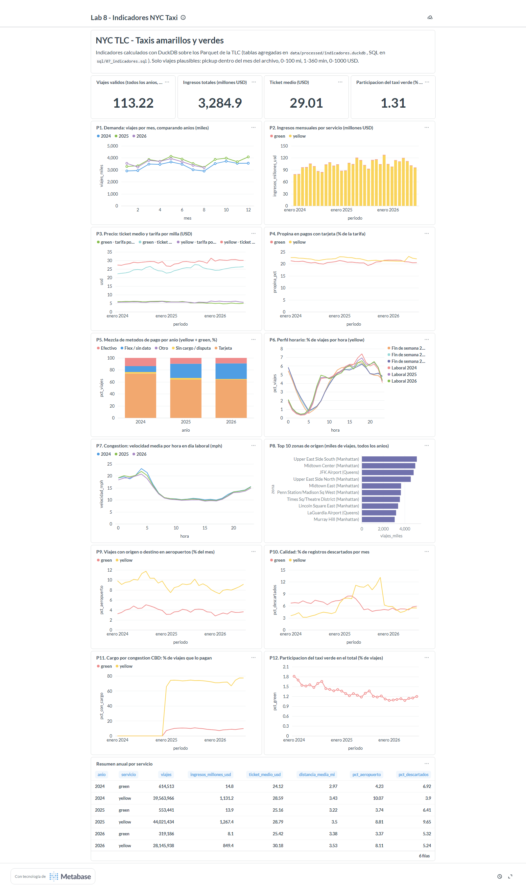

# Ejercicio 8 (8.1 - 8.4) - Incorporacion de 2025

Punto de partida: datos de 2024 y 2026 descargados y tablero del Ejercicio 7 construido sobre ellos
([`docs/07_indicadores_metabase.md`](07_indicadores_metabase.md)). La evolucion de los indicadores, los
cambios visibles con los tres anios y sus consultas (8.5 - 8.7) estan en
[`docs/08_evolucion_2024_2026.md`](08_evolucion_2024_2026.md).

## 8.1 y 8.2 Descarga de 2025 sin volver a bajar lo existente

```bash
docker exec lab8-lab python scripts/download_data.py --years 2025                 # descarga solo 2025
docker exec lab8-lab python scripts/download_data.py --years 2024 2025 2026       # re-ejecucion: no baja nada
docker exec lab8-lab sh -c "cd scripts && python verify_downloads.py --years 2024 2025 2026"
docker exec lab8-lab python scripts/build_indicadores.py                          # mismas consultas, ahora con 2025
docker compose restart metabase                                                   # ver 7.5
docker exec lab8-lab python scripts/metabase_dashboard.py --publico               # mismo tablero, datos nuevos
```

| Paso | Resultado | Tiempo |
|---|---|---|
| Descarga de 2025 | 24 archivos descargados (12 yellow + 12 green), 0 fallidos; 792 MB yellow + 14 MB green | 188 s |
| Re-ejecucion con los tres anios | **0 descargados, 64 ya existian**, 8 no publicados (sep-dic 2026), 0 fallidos | 7 s |
| Verificacion | `OK=64 faltantes=0 con_error=0` (tamano = `Content-Length` remoto y footer Parquet legible) | - |
| Reconstruccion de indicadores | `ind_mensual` 40 -> 64 filas; 72 M -> 121 M de registros leidos | 67 s -> 104 s |
| Tablero | Las 17 tarjetas se recrearon sin cambiar una linea de SQL | ~20 s |

Nada de lo existente se volvio a descargar ni se modifico: el script omite los archivos que ya
existen con el mismo tamano que en el servidor.

## 8.3 Las consultas siguen funcionando? Que hubo que cambiar

**En el codigo de descarga y de indicadores: nada.** El anio es un parametro (`--years`), las rutas usan
comodines (`*/*.parquet`) y el anio/mes se derivan del nombre del archivo, asi que 2025 aparecio en
todas las tablas y tarjetas automaticamente.

Lo que si aparecio al revisar las consultas anteriores con 2025 presente:

1. **Un numero fijo en `sql/05_validacion_2024_2026.sql` (Q4).** La consulta de diferencias de esquema
   tenia `HAVING meses_con_columna < 20` (20 = meses de 2024 + 2026). Con 32 archivos,
   `cbd_congestion_fee` (presente en 20) desaparecia del resultado **sin ningun error**. Se reemplazo el
   20 por el total calculado de archivos. Es el tipo de fallo mas peligroso: la consulta "funciona" pero
   responde otra cosa.
2. **Consultas acotadas a proposito** a un anio (Ej. 3 y 4: 2026) o a 2024 vs 2026 (Q5 y Q6 del Ej. 5)
   siguen dando lo mismo: filtran por ruta o por `year(...)`, y asi deben quedar porque responden a
   esos ejercicios.
3. **Metabase** necesito un reinicio para ver la base reconstruida (driver DuckDB, ver 7.5).

### Validacion de 2025 con las consultas del Ejercicio 5

| Comprobacion | Resultado |
|---|---|
| Archivos por tipo y anio (Q1 del Ej. 5, sin cambios) | yellow 2025: 12, green 2025: 12 |
| Registros (Q2 del Ej. 5) | yellow 2025: 48.722.573; green 2025: 591.354 |
| Esquema | 2025 trae `cbd_congestion_fee` desde enero (20 de 32 archivos yellow: todo 2025 y 2026); `request_source` sigue solo en jun-ago 2026; `union_by_name` rellena con NULL en 2024 |
| Continuidad | Ningun mes faltante entre 2024-01 y 2026-08 (P1 y P2 sin huecos) |

## 8.4 Indicadores y visualizaciones actualizados a los tres anios

Antes (2024 + 2026): [`img/07_tablero_2024_2026.png`](img/07_tablero_2024_2026.png). Despues:



Que cambio al agregar 2025:

- **P11 (cargo CBD)**: sin 2025 la linea subia en diagonal de 0 % (dic-2024) a 72 % (ene-2026), como si
  el cargo se hubiera extendido de a poco. Con 2025 se ve lo que paso: un **salto en enero de 2025**
  (inicio del cargo el 5-ene-2025): 65,9 % de los viajes yellow en enero (mes incompleto) y 71-77 % desde febrero.
- **P1 (demanda)**: 2025 es el anio mas alto en 6 de los 8 meses comparables (en enero y abril lo iguala o supera 2026); la "subida 2024 -> 2026" del
  Ej. 7 es en realidad una subida en 2025 (+12,5 %) y una leve baja en 2026 (-1,6 %).
- **P10 (calidad)**: aparece un tramo de mayo a noviembre de 2025 con 10-13 % de registros yellow
  descartados, invisible con solo 2024 y 2026 (ver [`08_evolucion_2024_2026.md`](08_evolucion_2024_2026.md), 8.5.6).
- **P5 (pagos)**: el paso de tarjeta a "Flex / sin dato" ocurrio en 2025, no en 2026.
- KPI: 113,2 M viajes validos, 3.284,9 M USD, ticket 29,01 USD, verde 1,31 %.

### Que caracteristicas del diseno lo hicieron posible

1. **Anio como parametro y rutas con comodin** (`data/raw/<tipo>/<anio>/`): agregar un anio es agregar
   una carpeta.
2. **Descarga idempotente y verificable**: re-ejecutar no cuesta nada (7 s) y no toca lo existente.
3. **SQL sin anios fijos** en la capa de indicadores: anio y mes salen del nombre del archivo.
4. **Separacion datos crudos / agregados / visualizacion**: solo la capa agregada se reconstruye
   (104 s); los Parquet no se transforman y Metabase no cambia de configuracion.
5. **Tablero generado desde el SQL** (`metabase_dashboard.py`): se recrea igual con los datos nuevos.

Lo que el diseno **no** resolvia solo y hubo que corregir: el numero fijo de la Q4 del Ej. 5 y la
conexion cacheada de Metabase.
